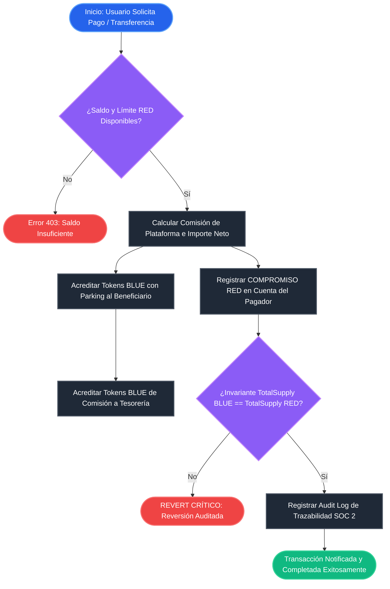
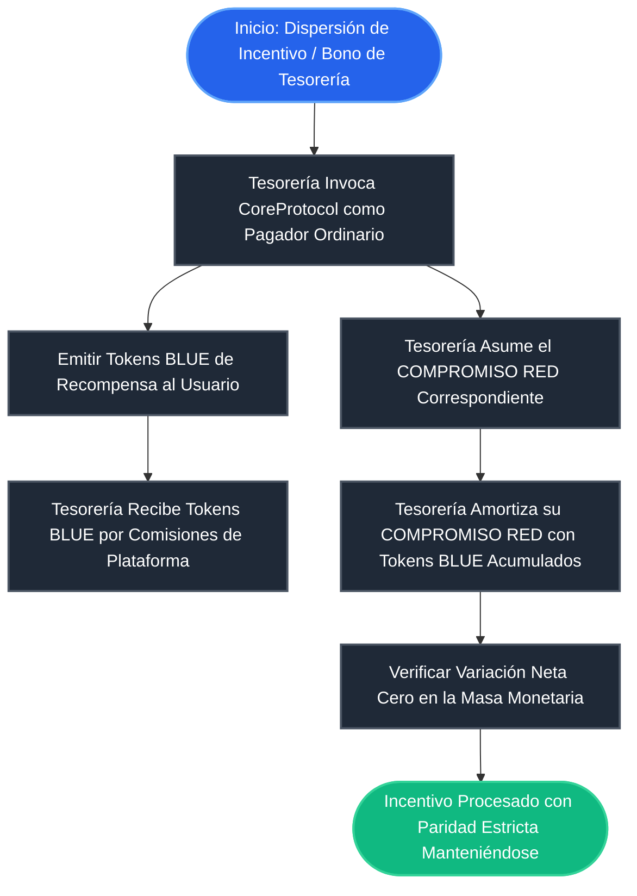
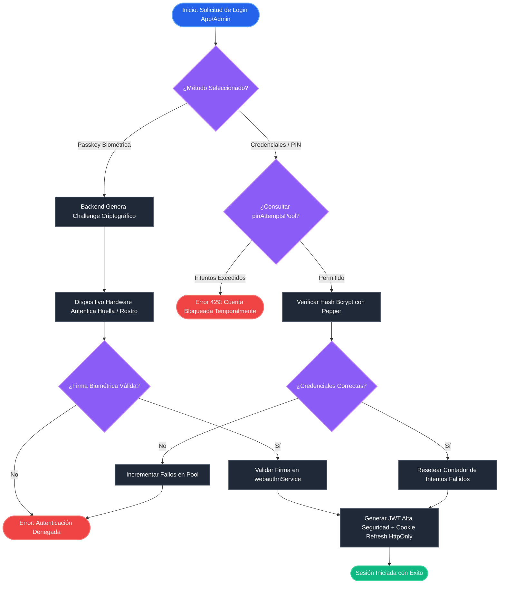
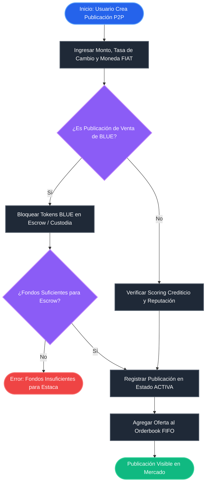
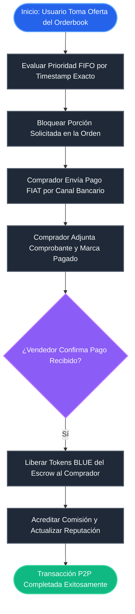
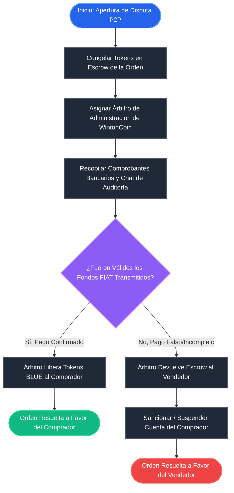
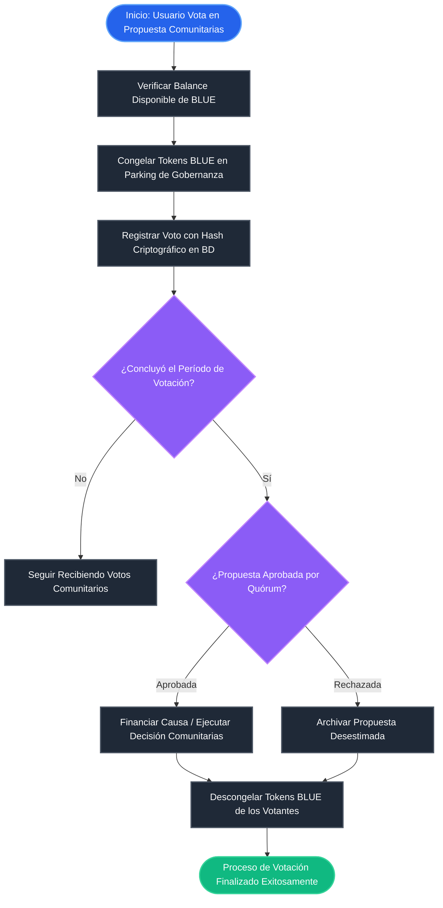
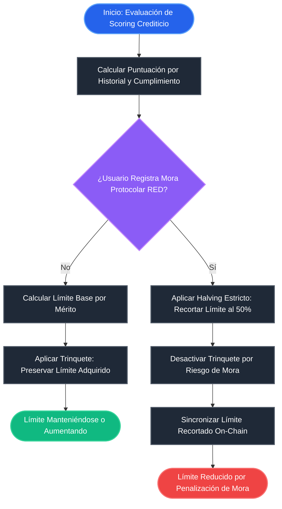
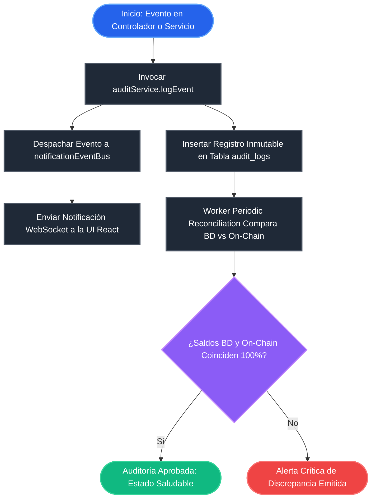

# DIAGRAMAS DE FLUJO VISUALES E INTEGRALES - WINTONCOIN PROTOCOL

> [!NOTE]
> **Visor Gráfico Interactivo**: Para explorar estos diagramas en formato web vectorial interactivo con pestañas de navegación y zoom, puedes abrir el archivo [`docs/DIAGRAMAS_VISUALES_PROYECTO.html`](file:///c:/Users/migue/OneDrive/Escritorio/WINTONCOIN/smart-contract/docs/DIAGRAMAS_VISUALES_PROYECTO.html) directamente en tu navegador.

---

## 1. Protocolo Económico Fundamental: Generación, Compromiso RED y Paridad BLUE/RED

### 1.1 Diagrama Visual: Transacción de Pago y Emisión de COMPROMISO RED (`financialCoreService.processPayment`)
Este diagrama representa visualmente la paridad 1:1 entre el token **BLUE** y el **COMPROMISO RED** asumido por el pagador.

---

### 1.2 Diagrama Visual: Dogfooding Protocolar de Tesorería (Incentivos sin Excepciones P2P)

---

## 2. Autenticación, Seguridad Zero-Trust & Registro de Cuentas

### 2.1 Diagrama Visual: Autenticación WebAuthn (Passkeys) & JWT (`authController` + `webauthnService`)

---

## 3. Motor P2P / Marketplace & Algoritmo FIFO

### 3.1 Diagrama Visual: Publicación con Estaca de Garantía (`publicationController.create`)

---

### 3.2 Diagrama Visual: Algoritmo Matching FIFO & Confirmación FIAT (`p2pController.matchOrder`)

---

### 3.3 Diagrama Visual: Disputas y Arbitraje P2P (`p2pController.disputeOrder`)

---

## 4. Gobernanza y Creador de Proyectos Solidarios

### 4.1 Diagrama Visual: Votación con BLUE en Parking (`governanceService`)

---

## 5. Credit Scoring, Halving & Subsidio de Gas

### 5.1 Diagrama Visual: Scoring Crediticio y Halving por Mora RED (`creditScoringService`)

---

## 6. Pipeline de Auditoría Bancaria SOC 2 & Trazabilidad Log

### 6.1 Diagrama Visual: Auditoría Inmutable (`auditService`) y Reconciliación

